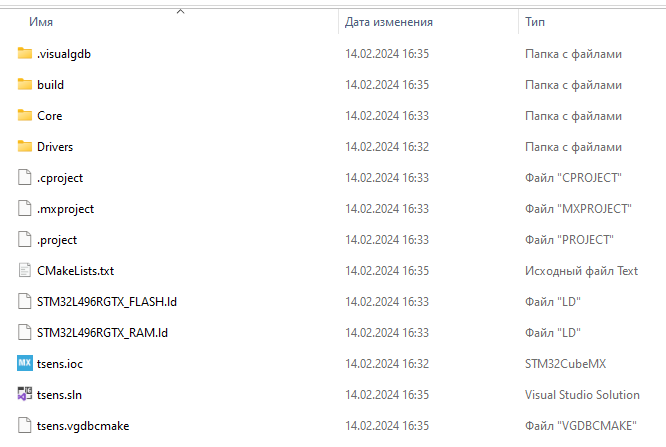

# Visual Studio 2019 English

## Создание проекта

1. File - Create - VisualGDB project - STM32CubeMX Project Wizard
1. Toolchain: arm-eabi, device: stm32l496rg6
1. Если открывается окно CubeMX - закрыть его (CubeMX файл после создания проекта будет подменен)
1. Выбрать debug method если известен (обычно J-link или St-link)
1. Finish  

## Настройка структуры проекта

1. Создать в корне проекта четыре папки: firmware, bootloader, common, mx

1. в папку mx переместить .ioc, .mxproject, .project

1. в бутлоадер переносим  CMakeLists.txt, STM32L496RGTX_FLASH.ld, .vgdbcmake

### Папка bootloader

1. .vgdbcmake файл переименовываем, добавля в название слово bootloader

1. удаляем .cproject, STM32L496RGTX_RAM.ld

1. удаляем папки Core, Drivers

1. Подменяем .ioc файл на нужный

1. Заходим в .ioc и вносим следующие настройки:
    - Project manager -> Project -> ставим галочку do not generate th main()
    - Project manager -> Code Generator  
    

    - Нажимаем generate code, должно появиться окно успеха  
    

    - Close, закрываем CubeMX

    - В папке mx должны появиться следующие файлы и папки:  
    

1. Открыть Solution в Visual Studio

1. В solution должен появиться Project бутлоадера  

1. Создаем в корне bootloader папку src и в ней файл main.c  

1. В CMakeLists.txt:
    - пишем относительный путь к .ioc
    - добавляем main.c
    - меняем имя проекта на project_name-bootloader
    - меняем имя проекта в функции add_bsp_based_executable как на картинке. В итоге:  
    

1. Solution right click -> Add -> Existing Project и в открывшемся окне выбрать файл .vgdbcmake  

1. В Visual Studio нажимаем Project -> Clean and Rebuild CMake Project

1. Конфигурация проекта должна пройти успешно  

1. Собираем проект -> Ctrl+Shift+B  

### Папка firmware

1. Копируем из bootloader в папку firmware следующее:  

1. В CMakeLists.txt меняем название проекта на project_name-firmware

1. Повторяем п.10 предыдущей части, но с папкой firmware  

1. Повторяем п.13. В итоге должно быть так:  
